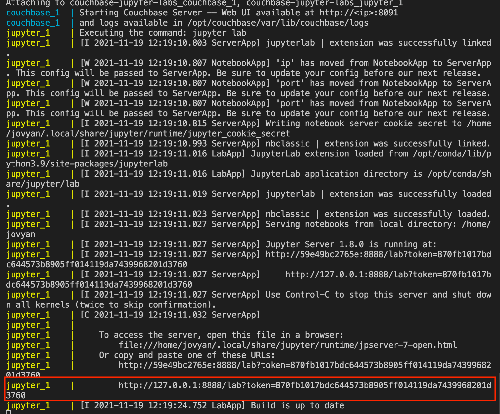

# Couchbase Jupyter Labs

A series of labs created to start using Couchbase with the Python SDK. It includes the following labs:

- Introduction to Couchbase
- Key Value Operations
- Indexing
- N1QL Querying
- Full Text Search

## Running the Labs Using Docker Compose

### Prerequisites

- [Docker & Docker Compose](https://docs.docker.com/compose/install/)

To bring up the Couchbase and the Jupyter Lab environment with the Couchbase Python SDK, run

`docker-compose up`

Access the Jupyter Lab environment by clicking on the access URL in the logs as shown in the screenshot below.

Couchbase can be accessed on
http://localhost:8091/

Note that it might take a few minutes to start Couchbase.

Follow the instructions in [Lab 1](notebooks/Lab_01_Introduction_to_Couchbase.ipynb)

Follow the rest of the labs sequentially.

#### Configuring the Couchbase Cluster Information for Examples

- The configuration is stored in an environment file, .env in this folder.

- Note that you might have to check for hidden files to see this file on Unix environments.

- This file can be used to update the connection settings.

  - DB_HOST: Set to `couchbase://couchbase` by default for connecting to the Couchbase cluster in the docker environment via Docker Compose. If you are running Couchbase locally on your machine via docker or installation, you can change the connection string to `couchbase://localhost`.
  - DB_USER: Set to `Administrator` by default. If it is different for your cluster, please update the file.
  - DB_PASSWORD: Set to `Password` by default. If it is different for your cluster, please update the file.

## Running the Labs Locally

### Prerequisites

- Python 3.8 or higher

- Install the Couchbase SDK (v4 or above) & Jupyter Lab

  `pip install couchbase jupyterlab python-dotenv`

- Running Couchbase using Docker

  `docker run -d --name db -p 8091-8094:8091-8094 -p 11210:11210 couchbase`

- Running the Labs by running Jupyter Lab from this folder
  `jupyter lab`

## Building Docker Image with Jupyter Lab & Couchbase SDK

`docker build -t couchbase-jupyter-lab .`

Running the Image
`docker run -p 8888:8888 -v $(pwd):/home/jovyan/work -it couchbase-jupyter-lab`

Click on the link to access Jupyter lab from the container logs as shown in the screenshot above.

#### Note

The Labs are not configured to be run using [Couchbase Capella](https://cloud.couchbase.com/). If you want to run it using Capella, the interface would be slightly different from the screenshots. Also, the connection strings & options would be slightly different. The connection string would be `couchbases://<connection_string_from_capella_ui>`. You would also need to whitelist the IP from which you are running the Notebooks on the Capella UI. For more details, you can check the [SDK Documentation](https://docs.couchbase.com/python-sdk/current/hello-world/start-using-sdk.html#full-example) on connecting to Capella.
